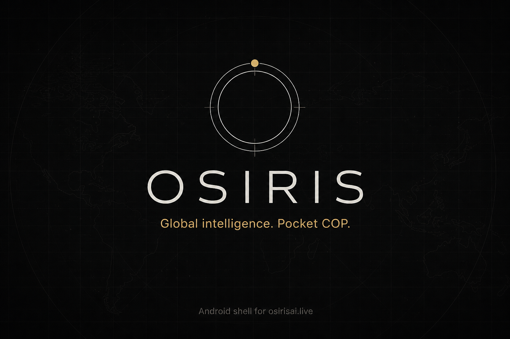
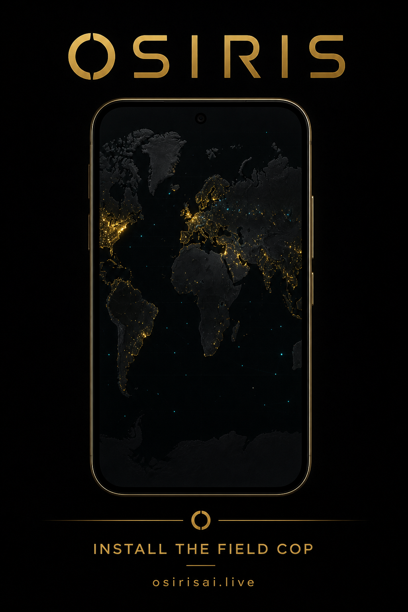

# OSIRIS Android

<p align="center">
  
</p>

**A free, security-hardened Android shell for [osirisai.live](https://osirisai.live)** — the open OSIRIS common operating picture (COP). Use the live map, layers, intel, markets, search, and RECON tools on phones and tablets with native splash, offline handling, share, and optional location.
This is provide free, as is, its purpose is to use the excellent osirisai.live , Osiris platofrm in a mobile android wrapper, with some ux/ui optimisation tools for mobile and tablets.

| | |
|---|---|
| **Package** | `live.osirisai.app` |
| **Host** | `https://osirisai.live` only (not a self-host client) |
| **Platform** | Android 8.0+ (`minSdk 26`) · target 35 |
| **Version** | 1.0.0 |
| **License posture** | Independent wrapper · provided free, as-is |

Upstream OSIRIS (MIT) by [SimplifAI Soul](https://github.com/simplifaisoul/osiris) · Docs: [osirisai.live/docs](https://osirisai.live/docs)

---

## For end users

<p align="center">
  
</p>

### What you get

- **Same COP as the web app** — flights, maritime, hazards, cyber, OSINT layers on a GPU map (MapLibre).
- **Mobile-first chrome** — splash, offline / SSL / load-error overlays, Android back (Escape → history → exit confirm).
- **Native helpers** — system share sheet, optional GPS for locate, About sheet (attribution, ethics, clear cache).
- **Hardened browsing** — HTTPS only, allowlisted navigation, external links in Chrome Custom Tabs.

### Who it’s for

Analysts, researchers, and operators who want a glanceable field COP on Android without installing a full browser session.

### Install (APK)

1. Prefer a **physical device** with OpenGL ES 3.0 (MapLibre WebGL is more reliable than many emulators).
2. Get a debug or release APK from a maintainer build, or build one yourself (see [Developers](#for-developers)).
3. Enable install from your chosen source, then:

```bash
adb install -r osiris-android/artifacts/app-release.apk
# or
adb install -r osiris-android/artifacts/app-debug.apk
```

4. Open **OSIRIS**, accept optional location only if you want native locate, and use the map like the website.

> **Play Store:** not required for sideload use. Signing for Play upload is documented under [Release](#release-signing).

### How to use the app

| Action | What happens |
|--------|----------------|
| Launch | Splash → loads `https://osirisai.live` |
| Layers / Intel / RECON / Search | OSIRIS mobile UI (unchanged upstream) |
| System Back | Tries in-page Escape, then WebView history, then exit confirm |
| Share | Via native bridge / About flows (URLs limited to osirisai.live) |
| Docs / external links | Chrome Custom Tabs (outside the locked WebView) |
| Offline / bad TLS | Native overlay — connection is not forced through |

### Responsible use

OSIRIS includes active RECON / scan-style tools. **Only target infrastructure you own or have written authorization to test.** Misuse may be illegal.

---

## For developers

App sources live under [`osiris-android/`](osiris-android/). Open that folder in Android Studio (not the monorepo root).

### Architecture (short)

```
┌─────────────────────────────────────────┐
│  Jetpack Compose shell (Kotlin)         │
│  splash · overlays · About · back       │
├─────────────────────────────────────────┤
│  Hardened WebView → osirisai.live only  │
│  allowlists · SSL fail-closed · Safe    │
│  Browsing · OsirisNative JS bridge      │
└─────────────────────────────────────────┘
```

This is **not** a TWA and **not** a native MapLibre rewrite. It wraps the production web COP with a lockdown shell.

### Requirements

- Android Studio Ladybug+ (AGP 8.7-compatible) **or** Docker (no host SDK)
- JDK 17
- Device/emulator with **OpenGL ES 3.0** (physical device recommended)
- `compileSdk` / `targetSdk` 35 · Gradle 8.9 wrapper

### Quick start (Android Studio)

1. **File → Open** → select `osiris-android/`
2. Let Gradle sync; create `local.properties` with `sdk.dir=…` if needed
3. Run the **app** configuration

### CLI build

```bash
cd osiris-android
./gradlew :app:assembleDebug
./gradlew :app:test
```

Windows:

```powershell
cd osiris-android
.\gradlew.bat :app:assembleDebug
.\gradlew.bat :app:test
```

Outputs under `osiris-android/app/build/outputs/apk/` (also copyable to `artifacts/` via Docker — see below).

### Docker build (no host JDK/SDK)

```bash
cd osiris-android
docker compose -f docker-compose.build.yml build
docker compose -f docker-compose.build.yml run --rm android-build
```

APK: `osiris-android/artifacts/app-debug.apk`

> Nested Android emulators inside Docker Desktop on Windows are unreliable. Install the APK on a host emulator or phone.

Full notes: [`osiris-android/docs/BUILD_AND_TEST.md`](osiris-android/docs/BUILD_AND_TEST.md)

### Playwright mobile E2E (web COP)

Tests hit live `https://osirisai.live` with Pixel 7 / iPhone viewports — the same UI the WebView loads (not the native About/offline chrome).

```bash
cd osiris-android/e2e
npm install
npx playwright install chromium
npm test
```

### Security model

| Control | Behavior |
|--------|----------|
| HTTPS only | Cleartext disabled (`network_security_config`) |
| Navigation allowlist | `osirisai.live` / `www` inside the WebView |
| Resource allowlist | Primary origin + known map CDNs; `data:` / `blob:` for WebGL |
| External links | Chrome Custom Tabs |
| SSL errors | Cancelled (fail closed) — never `handler.proceed()` |
| WebView lockdown | No file/content access, no mixed content, Safe Browsing on |
| JS bridge | Narrow `OsirisNative` / `OsirisShell`; sanitized share payloads |
| Permissions | Internet always; location optional at runtime |
| Backup | WebView data excluded |

Certificate pinning is **not** enabled in v1 (third-party origin; normal cert rotation would break the app).

Security backlog / Aikido notes: [`osiris-android/docs/AIKIDO_BACKLOG.md`](osiris-android/docs/AIKIDO_BACKLOG.md)

### Native bridge

Available to the page as `OsirisNative` and `window.OsirisShell`:

| API | Purpose |
|-----|---------|
| `share(text)` / `shareUrl(url)` | Android Sharesheet (`https://osirisai.live…` only for URLs) |
| `requestLocation()` | Optional locate → `osiris-native-location` event |
| `openAbout()` | About sheet |
| `ping()` | Returns `osiris-native-1` |

### Project layout

```
aa/
├── README.md                          ← you are here
└── osiris-android/
    ├── app/                           ← Kotlin / Compose sources
    ├── docs/
    │   ├── BUILD_AND_TEST.md
    │   ├── AIKIDO_BACKLOG.md
    │   ├── BROCHURE_COPY.md
    │   ├── MARKETING_VIDEO_SCRIPTS.md
    │   └── marketing/                 ← README images
    ├── e2e/                           ← Playwright
    ├── Dockerfile
    ├── docker-compose.build.yml
    └── README.md                      ← short Studio pointer
```

### Release signing

1. Copy `osiris-android/keystore.properties.example` → `keystore.properties` (gitignored).
2. Point `storeFile` at your keystore; keep keystores **out of git**.
3. `./gradlew :app:assembleRelease`

Application ID: `live.osirisai.app` · debug suffix: `.debug`

### Marketing / brochure

- Copy: [`osiris-android/docs/BROCHURE_COPY.md`](osiris-android/docs/BROCHURE_COPY.md)
- Video scripts: [`osiris-android/docs/MARKETING_VIDEO_SCRIPTS.md`](osiris-android/docs/MARKETING_VIDEO_SCRIPTS.md)
- Art: `osiris-android/docs/marketing/*.png`

---

## Attribution

- **Upstream OSIRIS** — MIT · [simplifaisoul/osiris](https://github.com/simplifaisoul/osiris) · [osirisai.live](https://osirisai.live)
- **This repo** — independent Android shell; does not fork the Next.js app

## Support & contributing

- Prefer PRs against `main`; feature work can land via branches such as `cursor/osiris-android-shell`
- Open issues for shell bugs (WebView lockdown, overlays, bridge). Upstream map/API issues belong with [OSIRIS](https://github.com/simplifaisoul/osiris)
- Keep secrets, keystores, and `local.properties` local — never commit them
